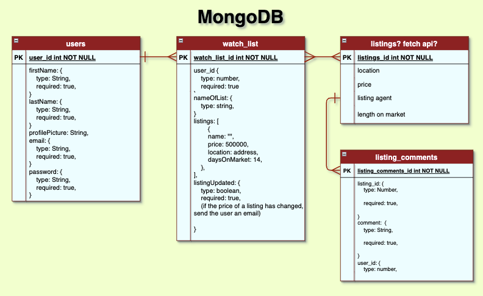
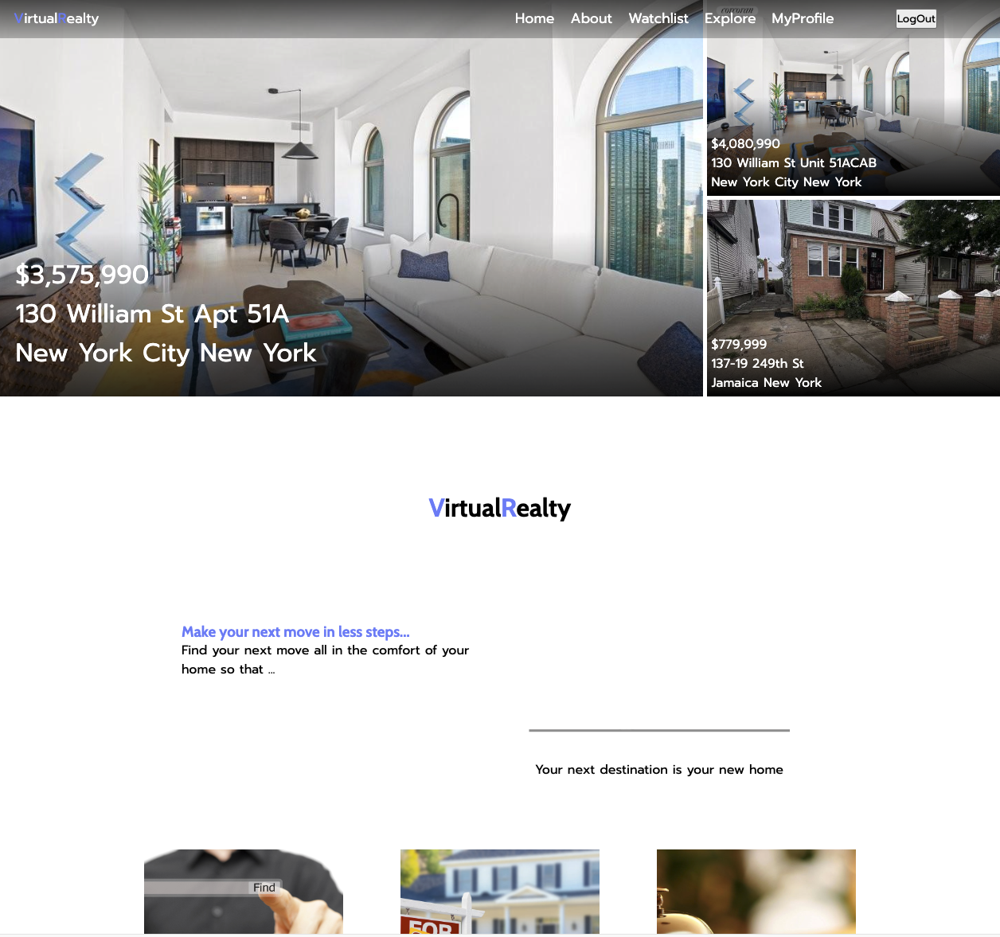
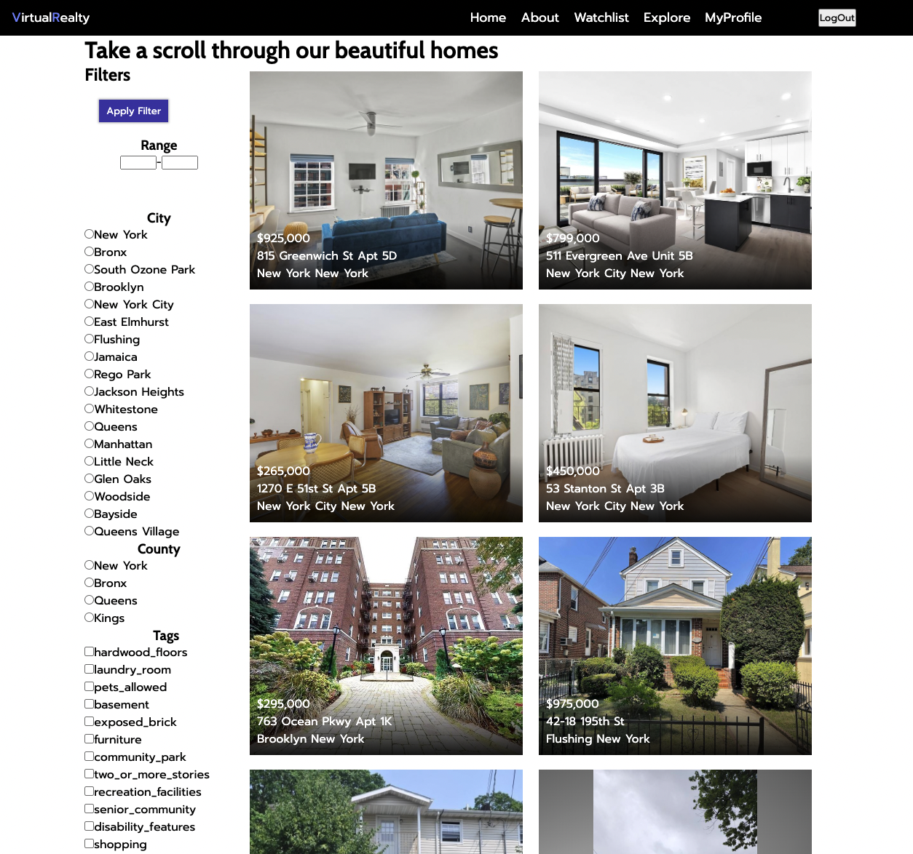
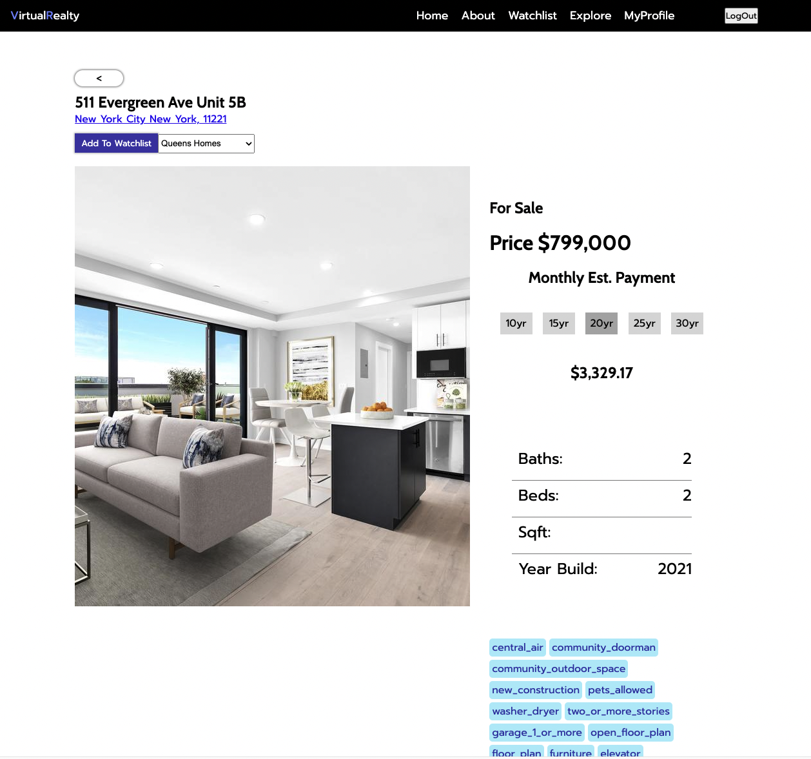
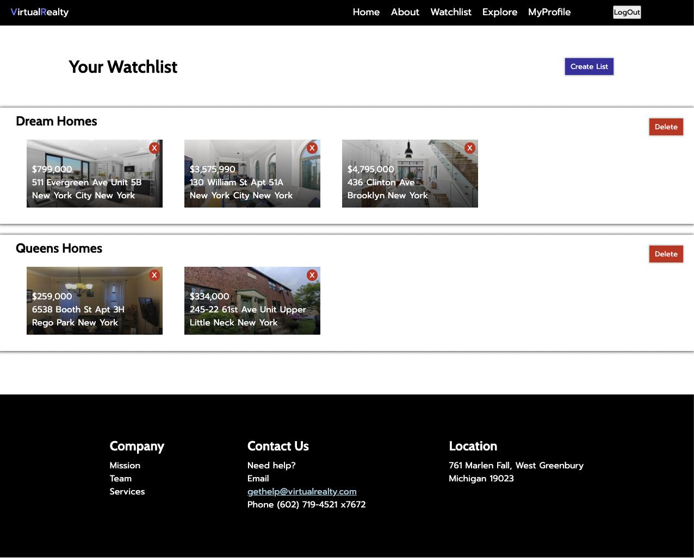
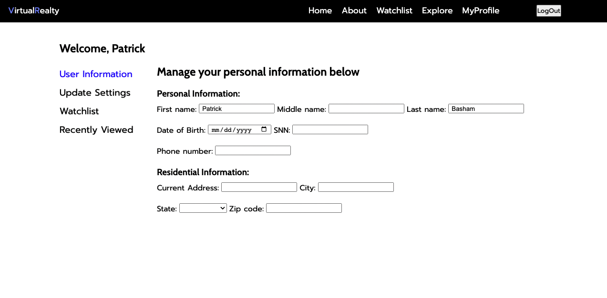
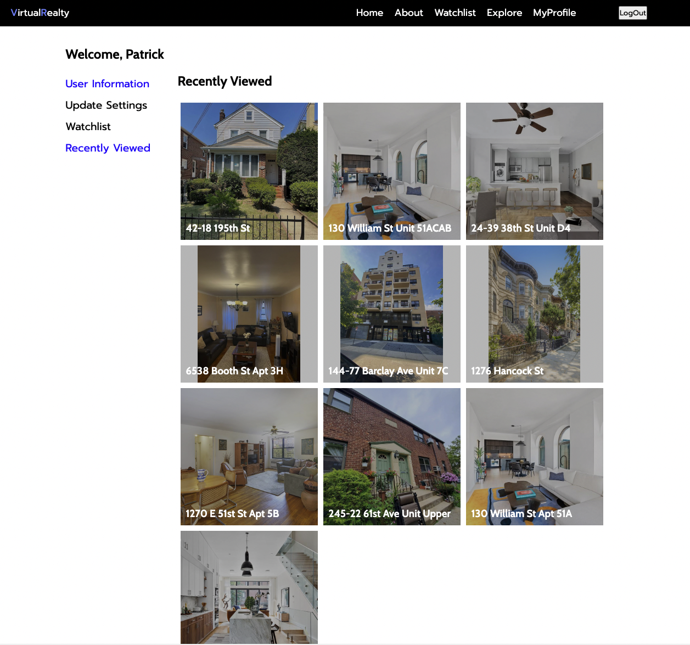

# VirtualRealty

# Premise: 
ß

# The User Story:
- I want to be able to sign up for an account.
- I can View the home page and choose where I could like to go from there.
- I Can go to About to learn about the company, team and services that the website offers.
- I can go to the explore page where I can view the available listings for sale.
- If I click a listing whenever it is shown I will be brough to the show page for the listing where I can view details about the listing as well as add it to a watchlist that i've created or if I have none, I may create one and add it.
- I can go to my profile page and update my personal information, update my account information, view my watchlist (ICE BOX) and view my recent views.

# The ERD: 

 
# The Wireframes:
## Home Page

___
## About Us Page

___
## Explore

___
## Listing Show Page

___
## User Watchlist Page

___
## profile page update section

___
## Profile page recently viewed section

# Technologies Used:
- React
- Javascript
- Express
- Nodejs
- MongoDB
- Mongoose

# Stretch goals / ICE BOX:
- User can update their personal / account information
- User can delete their accountß
- User can use a dropdown from the navbuttons and scroll using buttons to each section on a page.
- On show page user can click arrows to move through all images of listing
- Connect to AWS to allow for putting up image to sell a house.
- Impliment google map ago to give view of location on map and street view.